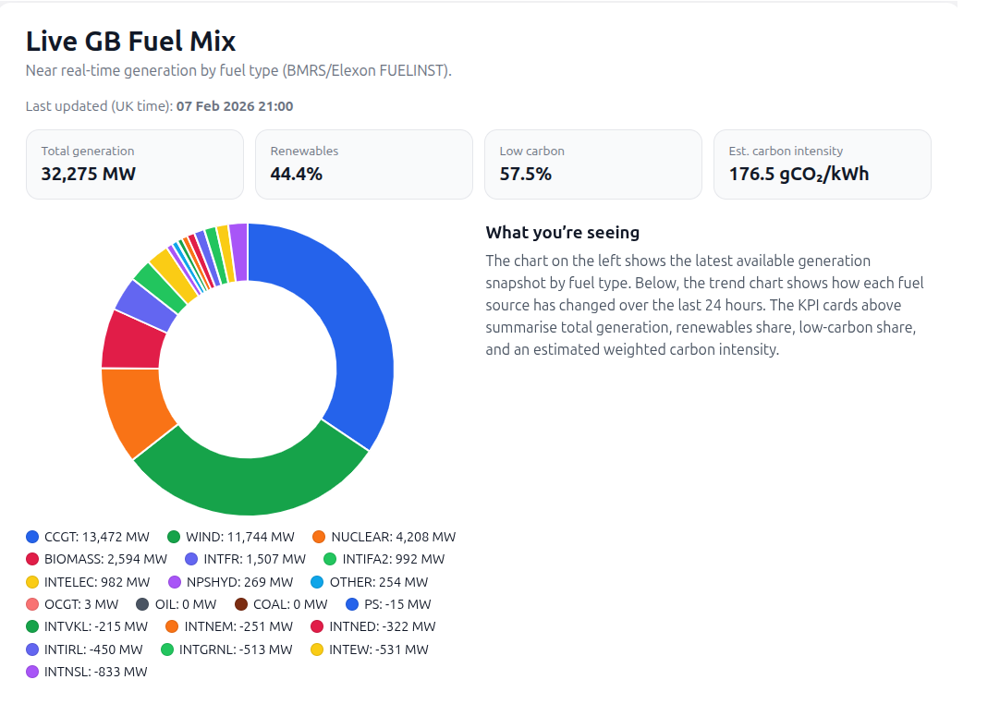
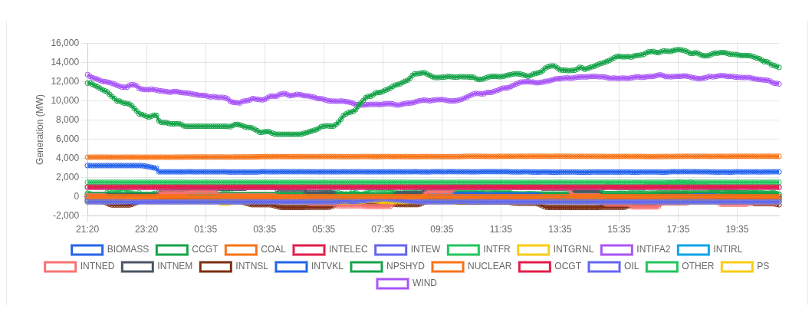

# mined-records-energy-data-platform
A live data engineering and analytics project ingesting real-time UK electricity generation data, calculating renewables share and carbon intensity, and presenting the results through an automated, monitored pipeline and public dashboard.

# UK Energy Data Platform (BMRS / Elexon)

A live, production-style data platform demonstrating how large, real-time datasets
from the UK electricity market can be ingested, transformed, analysed, and presented
via a public dashboard.

This project showcases end-to-end data engineering and analytics using:
- Python ETL
- MySQL (on shared hosting)
- Cron-based automation
- SQL analytics & views
- PHP + Chart.js frontend

---

## Overview

The platform pulls near real-time UK generation data from the BMRS / Elexon Insights API
(FUELINST dataset), stores it in a relational database optimised for time-series analysis,
derives carbon and renewables metrics, and exposes the results via a live dashboard.

The system is designed to run unattended and includes monitoring and alerting for data
freshness.

---

## Architecture

**Data flow:**

BMRS / Elexon API  
→ Python ETL (cron, idempotent upserts)  
→ MySQL (long-format fact table)  
→ SQL views (analytics layer)  
→ PHP dashboard (Chart.js)

Key design choices:
- Long-format storage for flexibility and scalability
- Composite primary keys for safe re-runs
- Derived metrics via SQL views (not application logic)
- Monitoring separated from ETL

---

## Data Model

### Core fact table
`bmrs_fuelinst_api_long`
- One row per fuel type per timestamp
- Composite key: `(spot_time_utc, fuel_type)`
- Stores raw JSON for traceability

### Dimension table
`bmrs_fuel_type_dim`
- Fuel classification (renewable / low-carbon / fossil)
- Carbon intensity factors (gCO₂/kWh)

### Analytics view
`vw_bmrs_generation_metrics`
- Total generation
- Renewables %
- Low-carbon %
- Estimated carbon intensity (weighted)

---

## Live Dashboard

The public dashboard shows:
- Latest GB fuel mix (doughnut chart)
- Last 24 hours generation trend by fuel type
- KPI cards:
  - Total generation (MW)
  - Renewables share (%)
  - Low-carbon share (%)
  - Estimated carbon intensity (gCO₂/kWh)

📍 **Live demo:**  
https://www.minedrecords.com/live_fuel_mix.php

---

## Automation & Monitoring

- ETL runs every 10 minutes via cron
- Separate monitor job checks data freshness
- Email alert triggered if data becomes stale
- ETL run history stored in `bmrs_etl_runs`

This mirrors real operational practice rather than “fire-and-forget” scripts.

---

## Tech Stack

- **Python 3** – API ingestion, transformation
- **MySQL** – relational storage & analytics
- **Cron** – scheduling
- **PHP** – server-side dashboard
- **Chart.js** – visualisation
- **BMRS / Elexon Insights API** – live UK energy data

---

## Skills Demonstrated

- API ingestion at scale
- Time-series data modelling
- Idempotent ETL design
- SQL analytics & metrics derivation
- Production monitoring & alerting
- Translating raw data into decision-ready visuals

---

## Screenshots

---

## Notes

Carbon intensity values are estimated using published GB fuel-type factors and are
intended for analytical and demonstrative purposes.

---

## Authors

- **Database / Data Engineering:** Magnus Irvine  
- **Data Analysis & Reporting:** Partner collaboration

